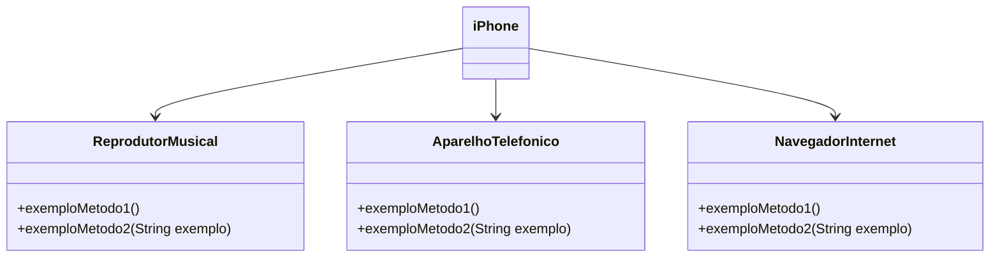
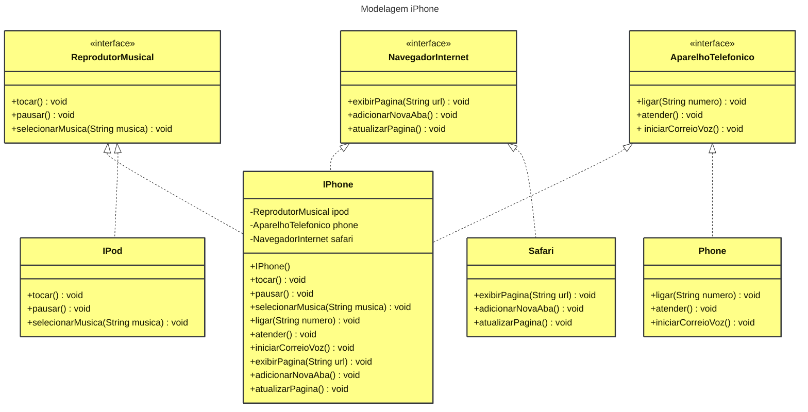

# Desafio - Modelagem e Diagramação de um Componente iPhone

Modelar e diagramar a representação UML do componente iPhone, abrangendo suas funcionalidades como Reprodutor Musical, Aparelho Telefônico e Navegador na Internet.

## Contexto
Com base no vídeo de lançamento do iPhone de 2007 (link abaixo), elaborar a diagramação das classes e interfaces utilizando uma ferramenta UML (draw.io, mermaid.js.org). Em seguida, implementar as classes e interfaces no formato de arquivos `.java` (opcional).

[Lançamento iPhone 2007](https://www.youtube.com/watch?v=9ou608QQRq8)
- Minutos relevantes: 00:15 até 00:55

### Funcionalidades a Modelar
1. **Reprodutor Musical**
   - Métodos: `tocar()`, `pausar()`, `selecionarMusica(String musica)`
2. **Aparelho Telefônico**
   - Métodos: `ligar(String numero)`, `atender()`, `iniciarCorreioVoz()`
3. **Navegador na Internet**
   - Métodos: `exibirPagina(String url)`, `adicionarNovaAba()`, `atualizarPagina()`

### Objetivo
1. Criar um diagrama UML que represente as funcionalidades descritas acima.
2. Implementar as classes e interfaces correspondentes em Java (Opcional).

### Exemplo de Diagrama UML (Mermaid)


### Instruções
1. Assistir ao vídeo do lançamento do iPhone para entender as funcionalidades principais.
2. Utilizar uma ferramenta UML para criar o diagrama das classes e interfaces. Pode-se utilizar o modelo acima (criado na sintaxe [Mermaid](https://mermaid.js.org/)), uma alternativa open-source e compatível com arquivos Markdown como este.
3. Opcionalmente, pode-se implementar as classes Java representadas no diagrama UML.
4. Submeter o repositório no GitHub conforme as orientações da plataforma DIO. Por exemplo:

```bash
https://github.com/glysns/trilha-java-basico/desafios/poo/README.md
``` 

## Resposta do Desafio - Diagrama UML (Mermaid) e Código em Java

- **Aluno**: [Leandro Silva](https://github.com/leanddrodev)

- **Diagrama de Classes**



- **Classes em Java**

[(Clique aqui).](https://github.com/leanddrodev/dio-trilha-java-basico/tree/main/desafio-modelando-iphone-uml/src)

